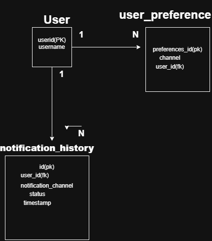

# Unified Notification System
 
A Spring Boot service that acts as a central hub for outbound notifications. It accepts a single generic request and routes it to the right channel(s) — Email, SMS, Push, or In-App — while respecting each user's opt-in preferences, and logs every dispatch attempt for auditing.

## Design Approach
The core problem — "send this message through N different channels"

## Tech Stack
 
- Java 17, Spring Boot 3.5
- Spring Data JPA + MySQL
- Spring Boot Validation
- Lombok


## Project Structure
 
```
src/main/java/com/rupesh/notification
├── controller/         REST endpoint
├── dto/                 NotificationRequest (API contract)
├── entity/              User, UserPreference, NotificationHistory
├── enums/                NotificationType, StatusType
├── repo/                Spring Data JPA repositories
└── service/
    ├── *.java           Service interfaces (NotificationService, UserService, UserPreferenceService, NotificationProvider)
    └── imp/               Implementations, including one class per channel
```


## API
 
### `POST /notification`
 
**Request body:**
```json
{
  "userID": 1,
  "notificationTittle": "Order Shipped",
  "notificationMessage": "Your order #123 has shipped.",
  "channels": ["EMAIL", "SMS", "PUSH"]
}
```

## Setup & Run Locally
 
### Prerequisites
- Java 17
- Maven (or use the included `./mvnw`)
- MySQL running locally
### 1. Create the database
```sql
CREATE DATABASE notification_db;
```


### 2. Set environment variables
The app reads DB credentials from environment variables:
```bash
 SPRING_DATASOURCE_USERNAME=your_mysql_username
 SPRING_DATASOURCE_PASSWORD=your_mysql_password
```

### 3. Run the app
```bash
./mvnw spring-boot:run
```
The app starts on `http://localhost:8080` (Hibernate auto-creates/updates tables via `ddl-auto=update`).

### 4. Insert a test user (no CRUD endpoints exist yet, so insert directly)
```sql
INSERT INTO User (user_name) VALUES ('Test User');
 
INSERT INTO user_preference (user_id, channel) VALUES (1, 'EMAIL');
INSERT INTO user_preference (user_id, channel) VALUES (1, 'SMS');
```


### 5. Test the endpoint on postman
```bash
POST http://localhost:8080/notification \
  "Content-Type: json" 
   {
    "userID": 1,
    "notificationTittle": "Test",
    "notificationMessage": "Hello",
    "channels": ["EMAIL", "SMS", "PUSH" , "INAPP"]
  }'
```


## ER Diagram & Class Diagram

Check diagram folder if link do nont work 
## ER Diagram



## Class Diagram


